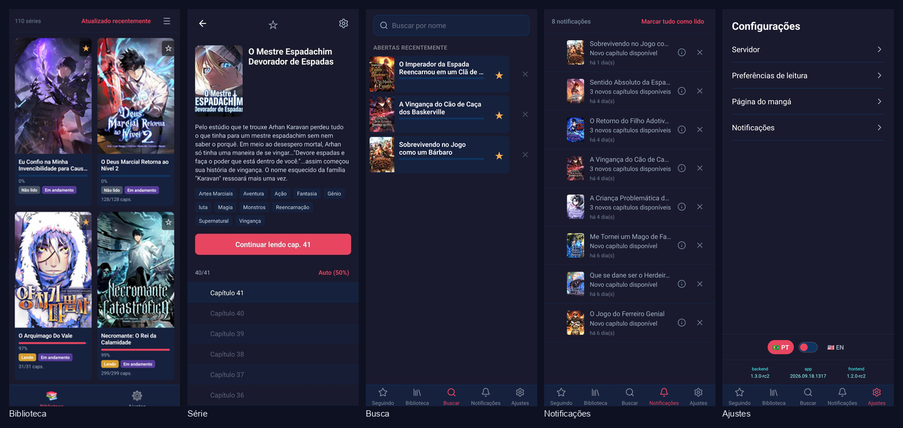
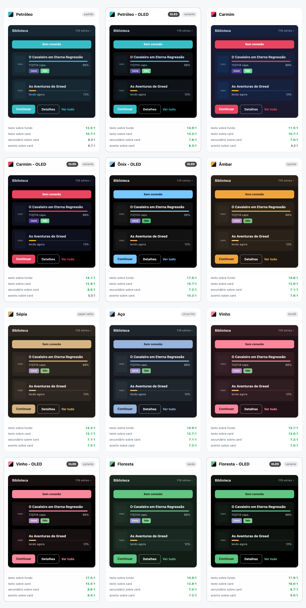

# My Manga Reader

[](LICENSE)
[](https://github.com/paulopotter/my-kavita-app-reader/releases/latest)
[](https://github.com/paulopotter/my-kavita-app-reader/releases/latest)
[](https://github.com/paulopotter/my-kavita-app-reader/releases/latest)
[](#)
[](#)

> 🇧🇷 [Versão em Português](README.md)

Android app for reading manga and webtoons from your own home servers - today
through [Kavita](https://www.kavitareader.com/), with room for others (see
[plugins](#plugins)).



## Why this app

**Most of what's new arrives on its own.** New screens, layout tweaks, fixes to
what you see - all of it lands without you installing anything, and you choose
how much you want to be told about it ([how it works](#update-policy)).

**One server, several addresses.** Register your home IP and your external
domain with priorities; the app tries them and uses whichever answers. Leaving
the house mid-chapter doesn't break your reading.

**New-chapter alerts** for the series you follow, with the notification history
kept inside the app itself ([what it takes](#features)).

**Extra details about your series**, such as publication status and how many
chapters are already downloaded, coming from a server of yours connected to the
app ([what it takes](#features)).

**Links open in the app.** A notification takes you straight to the series, and
your own server's addresses can open here instead of in the browser
([what it takes](#opening-your-servers-links-in-the-app)).

## Installation

The app isn't in any store - the installer comes straight from here:

1. Open the [latest release](https://github.com/paulopotter/my-kavita-app-reader/releases/latest)
2. Download the `.apk` file
3. On Android, allow your browser to install apps from outside the store - the
   system offers this when you open the file, or find it under
   *Settings → Apps → Special access → Install unknown apps*
4. Open the downloaded file and confirm the installation

On first launch the app asks for your Kavita server address and an API key -
which you generate in Kavita itself, under *Settings → API Key*.

## On screen

In the **library**, your series show up in a grid or a list, starting with the
most recently updated - or in alphabetical order, with a side index to jump
straight to a letter. Marking a series as a favourite creates the **Following**
tab, which disappears on its own if you follow none.

Open a **series** and you get the summary, the tags and the chapter list with
each one's progress - you can pick up where you left off with a single tap, or
mark several chapters as read at once.

**Search** finds your series by name and keeps the last ones you opened from
there, so you can get back to them quickly.

Binge without pauses: in the **reader**, scrolling is vertical and endless -
one chapter ends, the next one begins, no menu in the way and without losing
your place.

And the app is yours: in **settings** you connect your servers and set up the
rest your way - the screen that won't sleep mid-chapter, the order chapters
appear in, how alerts reach you, and the language (Portuguese and English).

**Twelve themes**, all dark, repainting as you pick one - no restart. Four of
them have an **OLED** version with a true black floor: on an OLED screen a black
pixel is switched off, which gives absolute contrast and costs no battery.
Every one clears the reading contrast bar
([WCAG AAA](https://www.w3.org/WAI/WCAG22/Understanding/contrast-enhanced)).



> Each theme up close: [see the folder](docs/external/screenshots/themes/).

> Every screen in the app: splash, welcome, library, following, series, reader,
> search, notifications and the settings pages.
> [See them all](docs/external/screenshots/grid_preview.png).

## Features

Anything not listed below works the moment you install the app.

- **⚙️ Needs a server of yours** - the app itself comes ready; you just point
  it at a server that provides the data.
  - [New-chapter notifications](#new-chapter-notifications) - alerts for the
    series you follow, with history inside the app
  - [External metadata](#external-metadata) - publication status and how many
    chapters are already downloaded

- **🔧 You have to build the app yourself** - it depends on details of yours
  that only go in when the app is assembled. The published version doesn't have
  them, so you clone the project, fill in what's missing and build the app on
  your own machine ([how to](#building-it-yourself)).
  - [Opening your server's links in the app](#opening-your-servers-links-in-the-app) -
    `http(s)` links from your Kavita opening in the app; the
    `mymangareader://` shortcut already works without this

- **📋 Planned** - doesn't exist yet.
  - **Other reading modes** - today only continuous scrolling; paged,
    horizontal and zoom are missing
  - **Home** - a landing page gathering what matters right now
  - **Themes** - changing the app's colours
  - **Multiple servers at once** - today one server group is active at a time

### New-chapter notifications

Alerts arrive through [ntfy](https://ntfy.sh/), a notification service you can
host at home or use on the public instance. The app follows a channel of yours
and shows alerts for the series you follow, with its own history, adjustable
retention and grouping of chapters from the same series.

You register the channel address inside the app itself, under settings - no
build needed. Until one is configured, the notifications tab stays out of the
way.

### External metadata

The app can query a second server (yours, not a public service) to enrich your
series with publication status, downloaded chapter counts and error flags. It's
optional: without it, everything works with what Kavita already provides.

You configure that address inside the app itself, with no need to rebuild it.
On the other end, the server only has to return the manga list with those
fields - the reference implementation lives in
`android/external-metadata-server/`.

### Opening your server's links in the app

The app already answers `mymangareader://` addresses in any version, including
the published one. That's what makes a notification open the right series, and
it also works for shortcuts you put together yourself.

What needs a build is your server's **real** address: tapping an `http(s)` link
from your Kavita and having it open in the app instead of the browser. Android
only accepts that association if the addresses are declared inside the app when
it is assembled, and they are yours. That's why the published version doesn't
have them: fill in `DEEPLINK_HOSTS` in the `.env` file and build the app
yourself ([how to](#building-it-yourself)).

### Plugins

Every connection to the outside world is called a **plugin**:

| Extension point | Today |
|---|---|
| Content server | Kavita |
| Notification provider | ntfy |
| External metadata | a server of your own |

Nothing else in the app knows the provider's name - the only place that knows
what "Kavita" is, is the plugin's own folder. So the app can adapt to whatever
you use: just add a new plugin, without touching what's already there. See
[CONTRIBUTING.en.md](CONTRIBUTING.en.md) to write your own.

## Update policy

Some of them arrive over **OTA** (*over-the-air*, meaning across the network,
without going through an installation). The app has two parts that update in
different ways: the **visual** one (the screens, the layout, what you see and
touch) comes over the network, on its own, with nothing to reinstall; the
**structural** one, what runs underneath, comes in a fresh installation.

Each visual update carries the warning it deserves, and some depend on you
having installed the newer structural part:

| | What happens |
|---|---|
| Silent | Only the visual part changes; applies in the background, no warning |
| Recommended | A new structural version is out, but the app keeps working without it - the notice can wait |
| Strongly recommended | You keep using the app, but stop receiving visual updates until you install the new version |
| Required | The app won't open until you install the new version |

## Building it yourself

```bash
# Install dependencies and validate environment
make setup

# Build debug APK
make build-android

# Build JS bundle
make build-bundle
```

See [CONTRIBUTING.en.md](CONTRIBUTING.en.md) for a detailed development
environment setup.

## License

Distributed under the [GNU General Public License v3.0](LICENSE).
