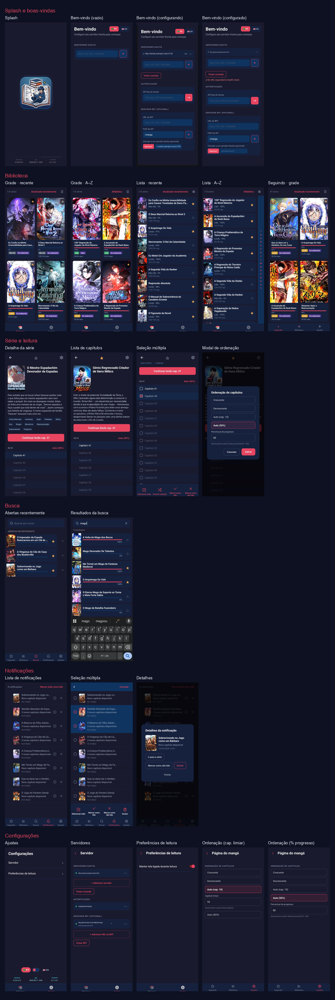

# My Manga Reader

[](LICENSE)
[](https://github.com/paulopotter/my-kavita-app-reader/releases/latest)
[](https://github.com/paulopotter/my-kavita-app-reader/releases/latest)
[](https://github.com/paulopotter/my-kavita-app-reader/releases/latest)
[](#)
[](#)

> 🇬🇧 [English version](README.en.md)

App Android para leitura de mangás via servidor [Kavita](https://www.kavitareader.com/),
com interface em React Native e atualização de UI sem reinstalar o APK (OTA).

> **Status**: em desenvolvimento inicial — não há release estável ainda.

## Screenshots



## Funcionalidades disponíveis

- [x] Tela de splash com sincronização inicial e progresso visual
- [x] Navegação principal com abas (Biblioteca, Configurações)
- [x] Atualizações OTA com políticas configuráveis (none, recommended, highly_recommended, required)
- [x] Tela de biblioteca com listagem de séries
- [x] Tela de configurações com gerenciamento de servidor e preferências

## Políticas de atualização OTA

Quando uma nova versão do bundle JS está disponível, o app pode exibir um aviso antes de aplicar a atualização:

| Política | Comportamento |
|---|---|
| `none` | Atualiza silenciosamente em background, sem aviso |
| `recommended` | Exibe um diálogo na splash — o usuário pode ignorar e continuar |
| `highly_recommended` | Exibe um diálogo bloqueante na splash; reexibe após 5 minutos dentro do app |
| `required` | Bloqueia o app permanentemente até o usuário acessar as novidades |

## Funcionalidades planejadas

- [ ] Leitor de mangás com controle de progresso
- [ ] Notificações de novos capítulos
- [ ] Suporte a plugins para fontes de dados e notificações

## Como instalar

Documentação de instalação disponível em [`docs/`](docs/) e no
[site do projeto](https://paulopotter.github.io/my-kavita-app-reader).

## Como fazer build

```bash
# Instalar dependências e validar ambiente
make setup

# Gerar APK de debug
make build-android

# Gerar bundle JS
make build-bundle
```

Veja o [guia de contribuição](CONTRIBUTING.md) para configuração detalhada
do ambiente de desenvolvimento.

## Licença

Distribuído sob a [GNU General Public License v3.0](LICENSE).
